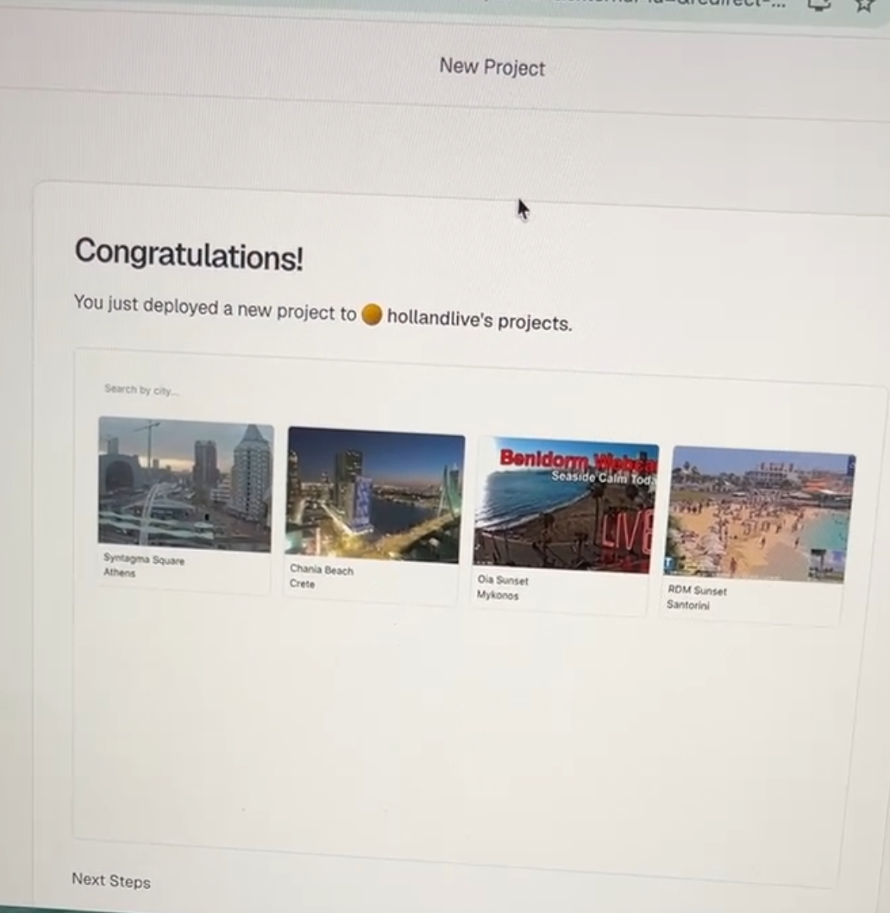
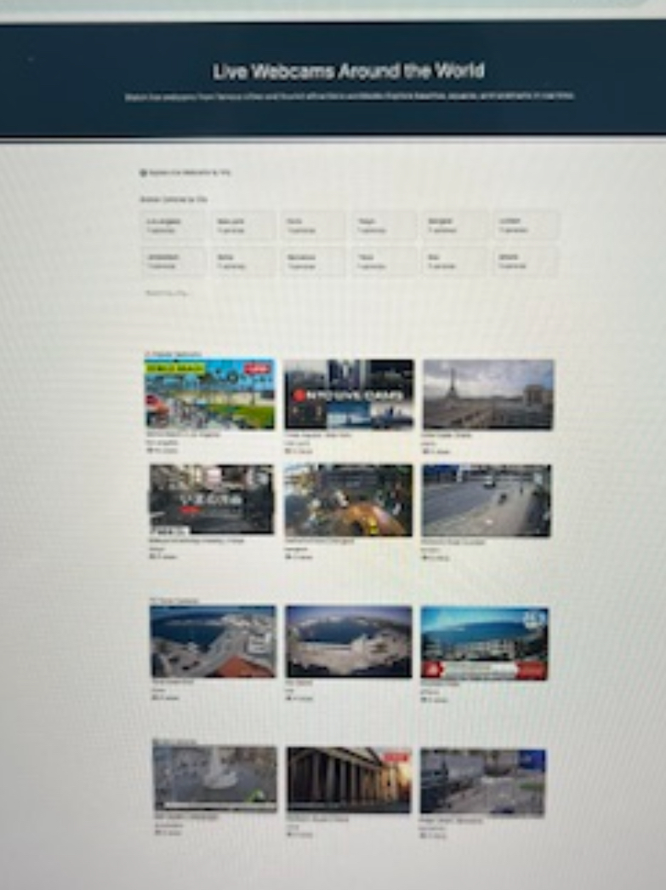
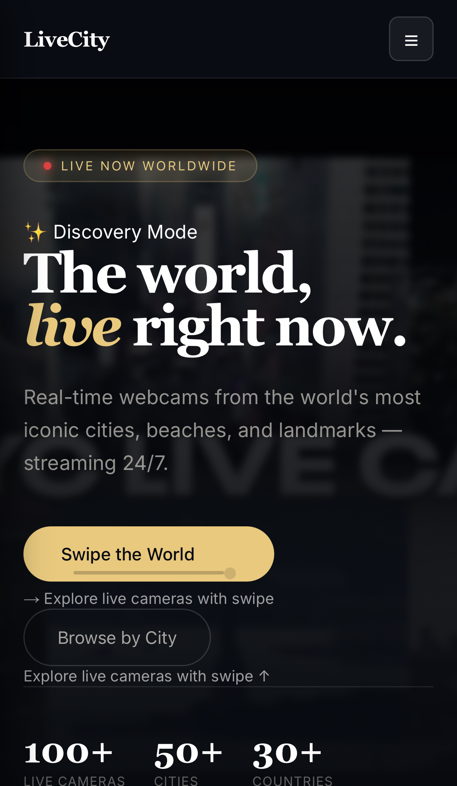
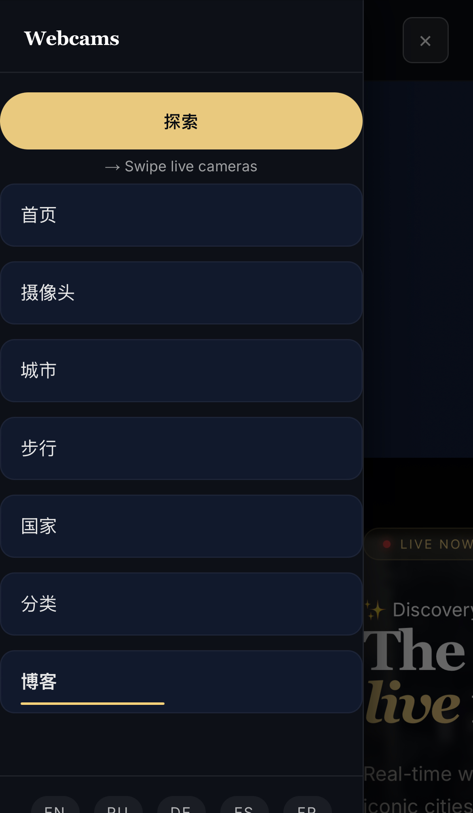

# LiveCity.cam

> Live webcams from cities, beaches and landmarks around the world — watch real-time streams and discover new places.

**[livecity.cam](https://livecity.cam)**

---


---

## About

LiveCity.cam is a platform for discovering live webcams worldwide. Browse cameras by city, country, category or region. Watch real-time streams from popular destinations, beaches, ports, airports and city centers — updated daily.

---

## Tech Stack

| Layer          | Technology                                               |
| -------------- | -------------------------------------------------------- |
| Framework      | [Next.js 16](https://nextjs.org) (App Router, Turbopack) |
| Language       | TypeScript 5                                             |
| Database       | [Supabase](https://supabase.com) (PostgreSQL)            |
| Auth / Storage | Supabase Auth + Supabase Storage                         |
| i18n           | Custom routing via `app/[locale]` + middleware           |
| Animations     | Framer Motion                                            |
| Deployment     | [Vercel](https://vercel.com)                             |
| Styling        | CSS Modules + custom design system                       |

---

## Features

- **Live webcam streams** — YouTube-embedded real-time cameras
- **12 languages** — EN, RU, DE, ES, FR, IT, AR, ZH, PL, NL, TR, EL
- **Browse by city** — hundreds of cities with live camera counts
- **Browse by country** — statically generated pages for all countries × all locales
- **Browse by category** — beach, airport, port, city, island, walking tours and more
- **Discovery mode** — TikTok-style vertical swiper for exploring cameras
- **Blog** — travel articles and destination guides
- **Weather integration** — real-time weather data on city pages
- **SEO-optimized** — structured data (FAQ, Breadcrumbs, City schemas), sitemap, robots.txt
- **Popular / New cameras** — ranked by Supabase view counters
- **Affiliate links** — contextual travel links per city

---

## Project Structure

```
app/
  [locale]/             # All localized routes (12 locales)
    page.tsx            # Home
    city/[city]/        # City detail pages
    country/[country]/  # Country pages (SSG × 12 locales)
    camera/[slug]/      # Camera detail pages
    category/[category]/
    blog/[slug]/
    discovery/          # Swiper mode
components/             # UI components (CameraCard, Navbar, CityList, ...)
lib/                    # Services, adapters, i18n helpers
data/                   # Static country/city data
```

---

## Getting Started

```bash
# Install dependencies
npm install

# Set up environment variables
cp .env.example .env.local
# Fill in NEXT_PUBLIC_SUPABASE_URL, NEXT_PUBLIC_SUPABASE_ANON_KEY, SUPABASE_SERVICE_ROLE_KEY

# Run dev server
npm run dev

# Build for production
npm run build
```

---

## Environment Variables

```env
NEXT_PUBLIC_SUPABASE_URL=
NEXT_PUBLIC_SUPABASE_ANON_KEY=
SUPABASE_SERVICE_ROLE_KEY=
OPENWEATHER_API_KEY=
```

---

## Locales

| Code | Language          |
| ---- | ----------------- |
| `en` | English (default) |
| `ru` | Russian           |
| `de` | German            |
| `es` | Spanish           |
| `fr` | French            |
| `it` | Italian           |
| `ar` | Arabic            |
| `zh` | Chinese           |
| `pl` | Polish            |
| `nl` | Dutch             |
| `tr` | Turkish           |
| `el` | Greek             |

Locale is resolved from the URL prefix (`/de/city/athens`). Missing locale → middleware redirects to `/en/...`.

---

## Deployment

Deployed on Vercel. Push to `main` triggers a production build automatically.

```bash
vercel --prod
```

---






**[livecity.cam](https://livecity.cam)**
